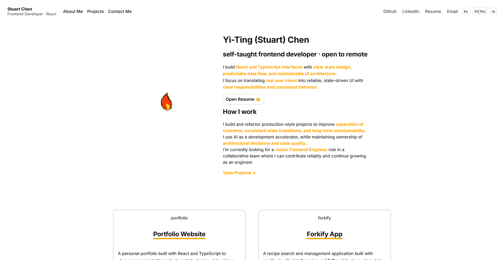
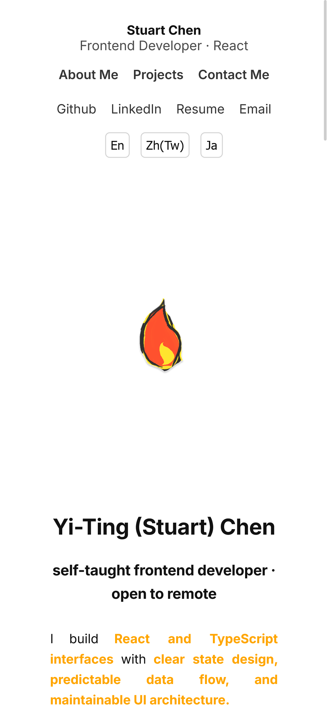
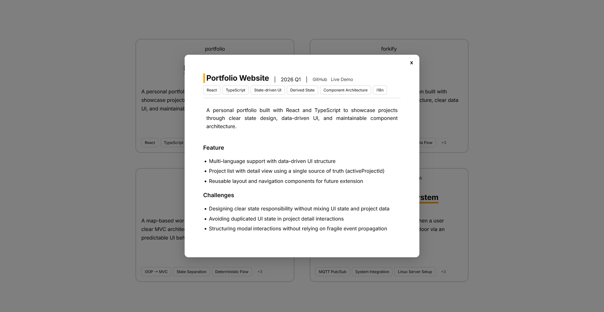

# Portfolio — React + TypeScript

A personal portfolio website built with **React** and **TypeScript**.

This project focuses on building a **maintainable UI architecture** and practicing:
- component design & responsibility boundaries
- state vs derived state
- data-driven UI patterns
- responsive layout for real devices (tested down to 320px)

## Live Demo
- Demo: https://stuartchendev.github.io/
- Repo: https://github.com/stuartchendev/stuartchendev.github.io

## Tech Stack
- React
- TypeScript
- CSS (responsive layout)
- Deployment: GitHub Pages

## Key Features
- Multi-language support (English / Traditional Chinese / Japanese)
- Projects list + project detail view (modal)
- Data-driven project structure (single source of truth)
- Reusable layout components (navigation / sections)
- Toolbar space reserved for future UI features (e.g. theme toggle)

## Architecture & Technical Decisions

### 1) State Responsibility (UI state vs data)
I store only **user-driven UI state** (e.g. active language, active project id).
Project content is treated as **data**, and feature components derive what they need.

This keeps the state model small and prevents duplicated or conflicting UI state.

### 2) Project Detail Interaction: `activeProjectId` as Single Source of Truth
I use `activeProjectId` to represent user selection.
The selected project is **derived** from this id.

**Why not a boolean `isOpen`?**  
Because the core interaction is selecting a **project entity**, not toggling a UI panel.
The UI presentation (modal/drawer) is a rendering detail.

### 3) Modal structure: overlay and modal as siblings
The overlay and modal are rendered as siblings instead of nesting the modal inside the overlay.

This avoids accidental dismissal and prevents relying on event propagation hacks.

### 4) Responsive design decisions
- Desktop: 2-column project grid for comparison
- Mobile: 1-column layout for readability and tap targets (tested at 320px)
- Large screens: constrain content width to keep visual density and scanning comfortable

### 5) Async State, Error Handling & Retry
(Implemented in `ProjectsPage` component)

**What**
- I model fetching as an explicit async state machine:
  `idle → loading → success | error`

**Why**
- Avoids scattered boolean flags (`isLoading`, `hasError`, etc.)
- Keeps UI predictable and makes retry behavior explicit
- Scales better when more async flows are added

**UI strategy**
- Treat `idle` as a loading state so the page shows a consistent loading UI immediately.
- `error` renders a visible fallback message and a `Retry` button.
- `Retry` re-runs the same async task and re-enters the state machine (`loading → success/error`).

**Implementation notes**
- The async task is derived from `activeLanguageId`, so it only re-fetches when language changes.
- Guard against stale responses (race conditions) so only the latest request can update the state.

**Trade-off**
- Slightly more verbose than a single `isLoading` flag, but clearer and more maintainable for real-world async UI.
## Scope Decisions (Intentional)
- Tag filtering is not implemented yet because the current project count is small.
  It becomes valuable when the list grows (see Future Improvements).

## Screenshots

### Desktop layout (2-column grid)


### Mobile layout (320px)


### Project detail modal



## Getting Started
```bash
npm install
npm run dev
```
## Build
```bash
npm run build
npm run preview
```
## Future Improvements
- Add tag filtering when the project list grows

- Improve project detail preview (lighter content, richer media such as GIF/video)

- Add theme toggle (dark mode)、back-to-top button

- Accessibility pass (focus states / aria labels / contrast)
